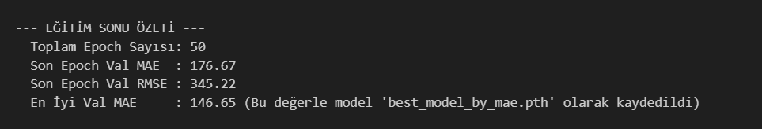
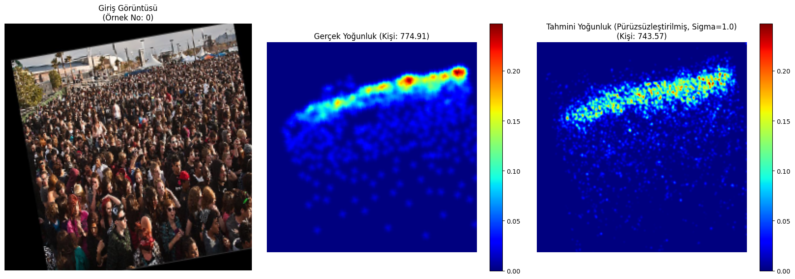

# Visual Crowd Density Estimation with Heatmap Regression

📌 **Overview**  
This project showcases a crowd density estimation model developed using heatmap regression techniques. Built as a term project for a university-level Computer Vision course, the goal was to estimate the number and spatial distribution of people in highly congested scenes using a convolutional neural network (CNN). The model was trained and evaluated on the ShanghaiTech Part A dataset.

🔍 **Objective**  
To design a deep learning system capable of accurately predicting crowd density in static images—an application with relevance to smart cities, surveillance, and public safety systems.

🧠 **Key Features**  

- Custom CNN model trained using PyTorch and heatmap regression for pixel-wise density estimation  
- Preprocessing and cleaning of the ShanghaiTech Part A dataset  
- Gaussian kernel-based ground truth generation  
- Visually and numerically consistent predictions for high-density environments  
- Accuracy enhancements via normalization, data augmentation, and targeted training strategies

🛠 **Tech Stack**  

- Python · Jupyter Notebook  
- PyTorch  
- OpenCV · NumPy · Matplotlib  
- Dataset: ShanghaiTech Part A  

📂 **Repository Structure**  

- `VisualCrowdDensityEstimation.ipynb` → Full model training and evaluation notebook  
- `report.pdf` → Academic report with methodology, visuals, and results  
- `presentation.pptx` → Project presentation slides  
- `images/` → Example input-output image pairs  
- `README.md` → Project summary and usage info  

📊 **Example Outputs**

Prediction heatmaps overlaid on crowd images — highlighting density concentrations clearly:

| Training Output | Prediction Example |
|------------------|---------------------|
|  |  |

🚀 **How to Run**

1. Clone this repository  
2. Download and extract the ShanghaiTech Part A dataset  
3. Open the `VisualCrowdDensityEstimation.ipynb` notebook  
4. Follow the instructions to preprocess data and train the model  
5. View prediction outputs and evaluate accuracy metrics  

📌 **Notes**  

- Developed individually as a 4rd-year undergraduate project in a Computer Vision course  
- Focuses on core computer vision workflows including CNN design, heatmap regression, and data preprocessing  
- While the model performs well visually, further improvements can be made for ultra-dense crowd scenes  

---

🎓 For academic or portfolio purposes only.
